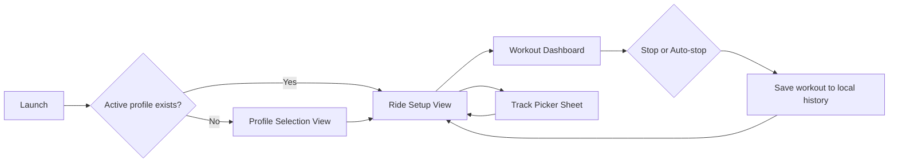
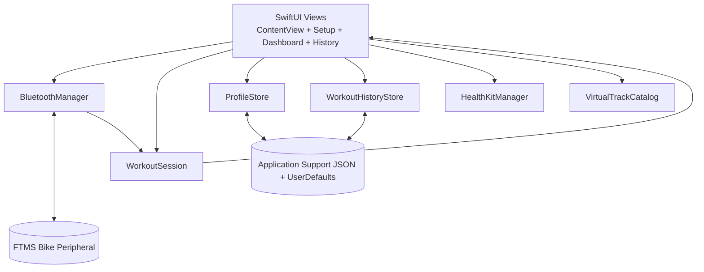
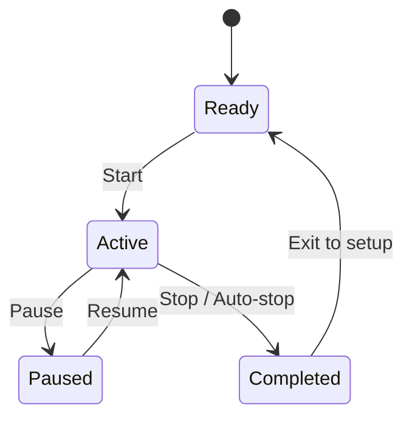
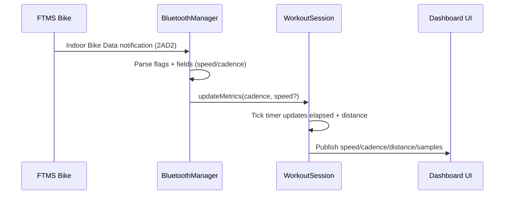
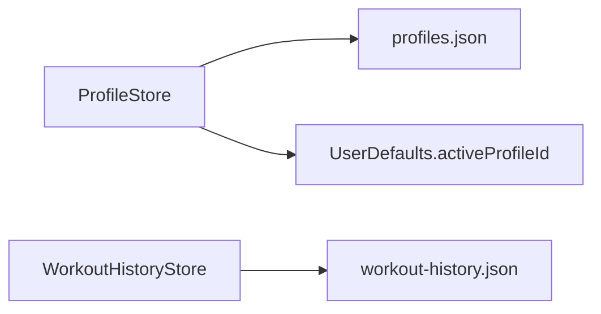

# BikeApp

BikeApp is an iPad-focused indoor cycling app built with SwiftUI.
It connects to an FTMS-compatible bike over Bluetooth, tracks cadence/speed/time/distance in real time, supports profile-based targets, optional virtual tracks, and stores workout history locally on-device.

## What this app does
- Connects to a bike over Bluetooth (FTMS service `1826`, Indoor Bike Data `2AD2`).
- Tracks live ride metrics:
  - speed
  - cadence
  - elapsed time
  - distance
- Supports profiles with per-profile target distance.
- Lets riders optionally pick a virtual track before entering workout mode.
- Auto-stops a workout when target distance or track distance is reached.
- Saves workouts locally and displays them in History.
- Shows cadence + speed analytics chart with cadence zone coloring.

## Product scope
- Platform: iPad (landscape UI).
- Storage: local only (`Application Support` + `UserDefaults`).
- Sync/login: not implemented.
- HealthKit: code path exists, but writes are currently disabled in app flow (`healthKitWritesEnabled = false`).

## App flow

## Runtime architecture

## Workout lifecycle/state machine

## Bluetooth parsing pipeline

## Persistence model

### Profile schema
- `id: UUID`
- `name: String`
- `colorHex: UInt32?`
- `iconName: String?`
- `targetDistanceKm: Double?`
- `createdAt: Date`

### Workout record schema
- `id: UUID`
- `profileId: UUID?`
- `startDate: Date`
- `endDate: Date`
- `distanceMeters: Double`
- `elapsedSeconds: TimeInterval`
- `trackId: UUID?`
- `trackName: String?`
- `trackDistanceKm: Double?`
- `trackProgressMeters: Double?`
- `trackCompleted: Bool?`

## Dashboard analytics chart

The chart combines:
- cadence bars (bucketed per 10 seconds)
- speed line overlaid on top

Cadence zones:
- `< 30`: white
- `30 - 50`: blue
- `50 - 70`: yellow
- `70 - 110`: green
- `> 110`: red

The speed line segment color follows the cadence zone of each segment.

## Auto-stop behavior
- If a virtual track is selected, track distance is used for auto-stop.
- Otherwise, profile target distance is used (if set).
- If no target and no track, workout does not auto-stop.

## Key files
- `BikeApp/BikeAppApp.swift`: app entry and initial route selection.
- `BikeApp/ContentView.swift`: setup screen, workout dashboard, controls, analytics graph.
- `BikeApp/Managers/BluetoothManager.swift`: BLE scanning, connect/reconnect, FTMS parsing.
- `BikeApp/Managers/WorkoutSession.swift`: workout state/timer/distance/samples.
- `BikeApp/Managers/WorkoutHistoryStore.swift`: local workout + profile persistence.
- `BikeApp/Models/VirtualTrack.swift`: virtual track and segment definitions.
- `BikeApp/Views/VirtualTrackViews.swift`: track card and animated lane visuals.
- `BikeApp/Views/HistoryView.swift`: workout history UI.
- `BikeApp/Utils/Data+LE.swift`: little-endian parsing helpers.

## Build and run
1. Open `BikeApp.xcodeproj` in Xcode.
2. Select the `BikeApp` scheme.
3. Set your signing team under target `BikeApp`.
4. Ensure `Info.plist` contains Bluetooth usage description (`NSBluetoothAlwaysUsageDescription`).
5. Run on iPad or iPad simulator.

## Troubleshooting
- Bluetooth not connecting:
  - verify bike is FTMS compatible
  - ensure Bluetooth permission is granted
  - power-cycle bike Bluetooth and relaunch app
- Build/signing errors:
  - use a valid team and provisioning profile
  - if using a free account, keep unsupported capabilities disabled
- No speed field from bike:
  - app can estimate speed from cadence using `metersPerRevolution`.

## Current limitations
- No cloud sync or account login.
- No background BLE session management.
- HealthKit save flow is present but disabled in current app flow.

